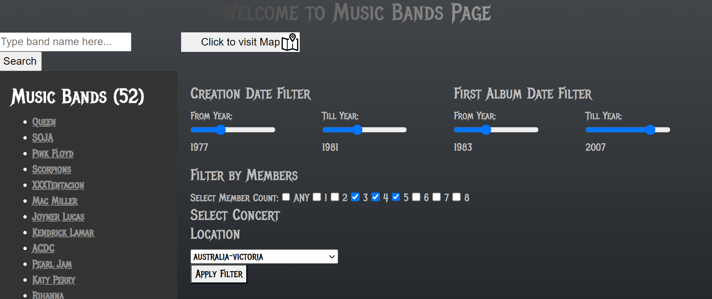
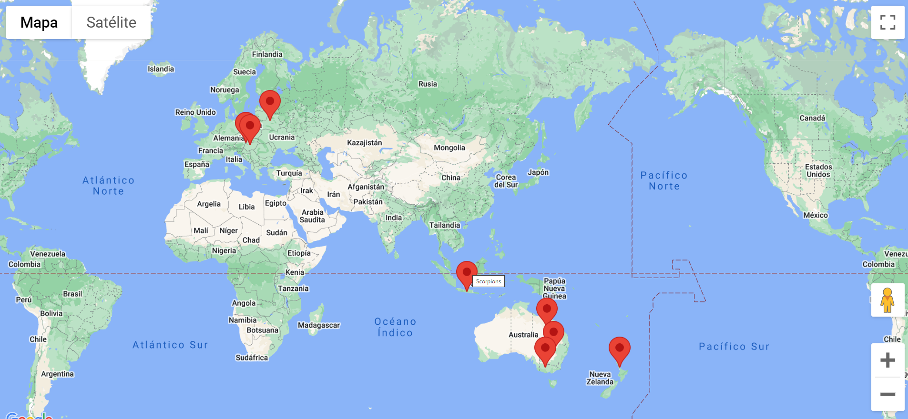

## groupie-tracker-geolocalization

## Authors

- [Denys Verves](https://github.com/TartuDen)
- [Yurii Panasiuk](https://01.kood.tech/git/ypanasiu)

## To run

```bash
go run .
```

```bash
http://localhost:8080/
```

### Objectives

Groupie Trackers consists on receiving a given API and manipulate the data contained in it, in order to create a site, displaying the information.

It will be given an API, that consists in four parts:

The first one, artists, containing information about some bands and artists like their name(s), image, in which year they began their activity, the date of their first album and the members.

The second one, locations, consists in their last and/or upcoming concert locations.

The third one, dates, consists in their last and/or upcoming concert dates.

And the last one, relation, does the link between all the other parts, artists, dates and locations.

### The Filters feature:
Consists on letting the user filter the artists/bands that will be shown.
 - selecting filters
### The Geolocalization feature:
Consists on mapping the different concerts locations of a certain artist/band given by the Client.
A process of converting addresses (ex: Germany Mainz) into geographic coordinates (ex: 49,59380 8,15052) which we use to place markers for the concerts locations of a certain artist/band on a map is used.
Google API map was used for this project.
 - selected locations of concerts


### Instructions

The backend is written in Go.

### Usage
Here is a simple example of the process of giving an address and returning a marker to the location.

This project helped us to learn about :

Manipulation and storage of data
HTML
Manipulation of Maps API
Geolocation, geocoding, etc
Event creation and display
JSON files and format
