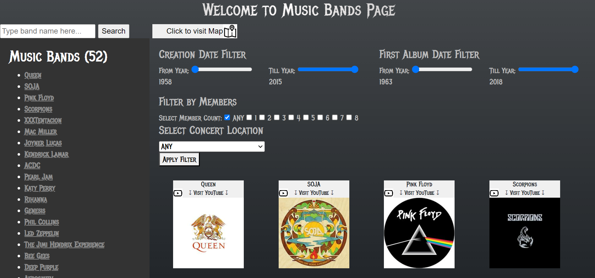
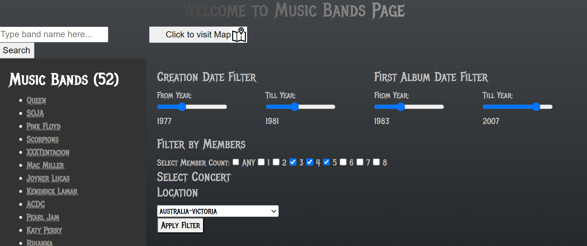
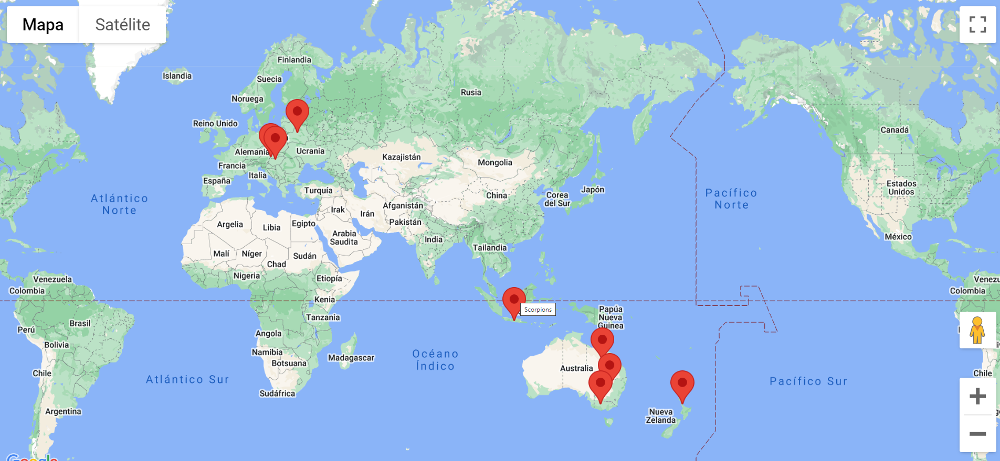

## groupie-tracker-geolocalization

## Authors

- [Denys Verves](https://github.com/TartuDen)
- [Yurii Panasiuk](https://github.com/pomog)

## To run

```bash
go run .
```

```bash
http://localhost:8080/
```

### Objectives

Trackers consists of receiving a given API and manipulating the data contained in it, in order to create a site, displaying the information.

It will be given an API, that consists of four parts:

The first one, artists, contains information about some bands and artists like their name(s), image, in which year they began their activity, the date of their first album and the members.

The second one, locations, consists of their past and/or upcoming concert locations.

The third one, dates, consists of their last and/or upcoming concert dates.

And the last one, relation, links all the other parts, artists, dates, and locations.


### The Filters feature:
Consists of letting the user filter the artists/bands that will be shown.
The visual effects of filters are done using JS on the Client side and the logic on the Server side using Golang.
 - selecting filters

### The Geolocalization feature:
Consists of mapping the different concerts locations of a certain artist/band given by the Client.
A process of converting addresses (ex: Germany Mainz) into geographic coordinates (ex: 49,59380 8,15052) which we use to place markers for the concerts locations of a certain artist/band on a map is used.
Google API map was used for this project.
 - selected locations of concerts

# NB! Set API key in: "visualization/structs.go" and "visualization/mapTempl/map.html" #

### Usage
This project helped us to learn about:

Manipulation and storage of data
HTML
Manipulation of Maps API
Geolocation, geocoding, etc
Event creation and display
JSON files and format

### Testing
The project has a unit tests file that tests some routine functions with coverage of about 30%.

### Unsolved Issues
1. SearchBar needs to be implemented
